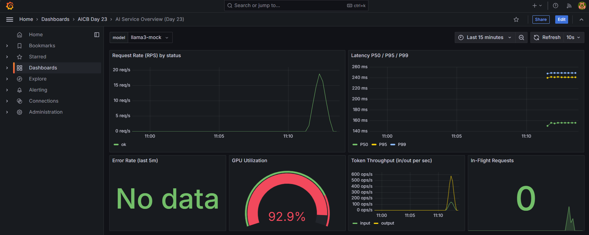
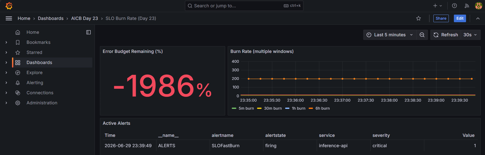
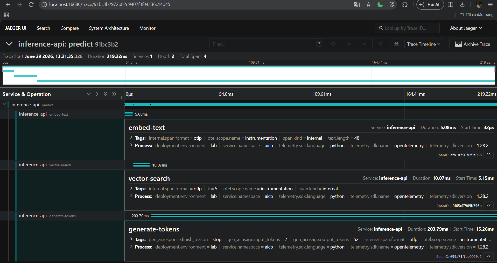

# Day 23 Lab Reflection

**Student:** Thái Thị Yến Nhi  
**Submission date:** 2026 - 06 - 29  
**Lab repo URL:** https://github.com/Lemin9802/Day23-Lab_2A202600783_Thai-Thi-Yen-Nhi

---

## 1. Hardware + setup output

I ran the Day 23 setup verification from WSL2 Ubuntu. Docker, Docker Compose, and required local ports were available, and the setup report was generated at `00-setup/setup-report.json`.

Key setup notes:

```text
Docker: available
Docker Compose: available
WSL2 Ubuntu environment: used
Required ports: available after freeing port 8000
Setup report: 00-setup/setup-report.json
```

The observability stack was then started with Docker Compose. The final stack included the FastAPI inference app, Prometheus, Grafana, Loki, Jaeger, Alertmanager, and the OpenTelemetry Collector.

---

## 2. Track 02 — Dashboards & Alerts

### 6 essential panels

Evidence screenshot:



The overview dashboard includes request rate, latency, error rate, GPU utilization, token throughput, and in-flight request panels.

### Burn-rate panel

Evidence screenshot:



The SLO burn-rate dashboard shows the error-budget remaining panel, multi-window burn-rate panel, and active alert state. I generated sustained error traffic to make the burn-rate line visible and to trigger the `SLOFastBurn` alert.

### Alert fire + resolve

| When | What | Evidence |
|---|---|---|
| T0 | killed/stopped `day23-app` | [alertmanager-firing.png](screenshots/alertmanager-firing.png) |
| T0+90s | `ServiceDown` fired | [slack-firing.png](screenshots/slack-firing.png) |
| T1 | restored app | app health returned OK |
| T1+60s | alert resolved | [slack-resolved.png](screenshots/slack-resolved.png) |

I also fixed Alertmanager's Slack webhook handling by writing the webhook URL to a file and using `api_url_file`, because the original templated environment variable path caused Alertmanager to fail when resolving the Slack URL.

### One thing surprised me about Prometheus / Grafana

The biggest surprise was how easy it is for a dashboard to look empty even when the system is working. For example, the SLO burn-rate panel initially had almost no visible line because the error traffic was sent in one short burst and Prometheus only scrapes every 15 seconds. Spreading traffic across several minutes made the burn-rate panel much more useful because Grafana had enough samples to draw a visible trend.

---

## 3. Track 03 — Tracing & Logs

### One trace screenshot from Jaeger

Evidence screenshot:



The final Jaeger trace shows:

```text
trace_id: 91bc3b2972b82e9402f3f04336c14d45
total spans: 4
parent span: predict
child spans: embed-text, vector-search, generate-tokens
GenAI attributes:
- gen_ai.request.model
- gen_ai.usage.input_tokens
- gen_ai.usage.output_tokens
- gen_ai.response.finish_reason
```

### Log line correlated to trace

Evidence file:

[json-log-with-trace-id.txt](json-log-with-trace-id.txt)

Representative JSON log line format:

```json
{
  "model": "llama3-mock",
  "input_tokens": 7,
  "output_tokens": 48,
  "quality": 0.761,
  "duration_seconds": 0.2628,
  "trace_id": "12d0ea4720f0c04b35881a828e3064ec",
  "event": "prediction served",
  "level": "info",
  "timestamp": "2026-06-29T05:32:21.099165Z"
}
```

The important part is that each structured JSON log includes a `trace_id`, so I can connect an inference log event back to a Jaeger trace.

### Tail-sampling math

The OpenTelemetry Collector uses tail sampling with three policies:

```text
keep all error traces
keep all slow traces over 2000 ms
keep 1% of healthy traces
```

For healthy traffic, if the service produced `N` traces per second, the collector would keep:

```text
kept healthy traces/sec = N * 0.01
```

For example, if the service produced 100 healthy traces per second:

```text
100 * 0.01 = 1 healthy trace/sec kept
```

Error traces and slow traces are different: they are kept at 100% by policy. This was important during the lab because normal successful `/predict` traces were often dropped by the 1% healthy sampling policy, so I had to generate enough requests and wait longer than the collector's `decision_wait` before a complete sampled trace appeared in Jaeger.

---

## 4. Track 04 — Drift Detection

### PSI scores

Evidence files:

- [04-drift-detection/reports/drift-summary.json](../04-drift-detection/reports/drift-summary.json)
- [drift-summary.json](drift-summary.json)
- [drift-summary.md](drift-summary.md)
- [drift-run.log](drift-run.log)

Drift summary:

```json
{
  "prompt_length": {
    "psi": 3.461,
    "kl": 1.7982,
    "ks_stat": 0.702,
    "ks_pvalue": 0.0,
    "drift": "yes"
  },
  "embedding_norm": {
    "psi": 0.0187,
    "kl": 0.0324,
    "ks_stat": 0.052,
    "ks_pvalue": 0.133853,
    "drift": "no"
  },
  "response_length": {
    "psi": 0.0162,
    "kl": 0.0178,
    "ks_stat": 0.056,
    "ks_pvalue": 0.086899,
    "drift": "no"
  },
  "response_quality": {
    "psi": 8.8486,
    "kl": 13.5011,
    "ks_stat": 0.941,
    "ks_pvalue": 0.0,
    "drift": "yes"
  }
}
```

The strongest drift appeared in `prompt_length` and `response_quality`. `embedding_norm` and `response_length` stayed stable.

### Which test fits which feature?

For `prompt_length`, I would use PSI in production because it is easy to explain and works well for monitoring distribution shifts in binned numeric features. It clearly showed drift in this lab with PSI = 3.461.

For `embedding_norm`, I would use KS or PSI. Since embedding norm is a continuous numeric feature, KS is useful for detecting shape changes in the distribution, while PSI is easier to summarize for dashboards. In this run, both indicated no meaningful drift.

For `response_length`, I would use PSI for dashboard-level monitoring and KS for deeper investigation. Response length is interpretable and easy to bucket, so PSI is useful for an operational drift signal.

For `response_quality`, I would use PSI plus KL divergence. PSI is good for alerting and explaining drift to operators, while KL is sensitive to distribution changes. In this lab, both PSI and KL were very high, so this feature clearly drifted and should trigger investigation.

---

## 5. Track 05 — Cross-Day Integration

### Which prior-day metric was hardest to expose? Why?

Evidence files:

- [integration-summary.md](integration-summary.md)
- [integration-day19-day20-prometheus-evidence.txt](integration-day19-day20-prometheus-evidence.txt)
- [day20-llamacpp-completion-response.json](day20-llamacpp-completion-response.json)

The Day19 Qdrant integration was straightforward because Qdrant already exposed Prometheus-compatible metrics at `/metrics`. I created a demo collection named `day23_integration_demo` with 3 vectors so the metrics were non-zero:

```text
collections_total = 1
collections_vector_total = 3
```

The Day20 llama.cpp metric was harder to expose. The Python `llama_cpp.server` started by `make serve` exposed OpenAI-compatible endpoints like `/v1/models`, but it returned 404 for `/metrics`. The fix was to run the compiled `llama-server` binary from the Day20 repo with the `--metrics` flag enabled. After that, Day23 Prometheus successfully scraped:

```text
llamacpp:prompt_tokens_total = 10
llamacpp:tokens_predicted_total = 16
```

This made Day20 the harder integration point because the model server had to be started in the correct mode before Prometheus could scrape it.

---

## 6. The single change that mattered most

The single change that mattered most was fixing the trace structure for `/predict`. Initially, the app created a manual `predict` span with `tracer.start_span("predict")`, but the child spans were not reliably attached to it as children. Jaeger showed separate one-span traces such as `predict`, `embed-text`, `vector-search`, and `generate-tokens`, which was technically trace data but not useful for debugging one end-to-end inference request.

The fix was to make the `predict` span the active current span while the child spans were created. After that, Jaeger showed one complete trace with `predict` as the parent and `embed-text`, `vector-search`, and `generate-tokens` as child spans. This connected directly to the deck concept that observability is not just about emitting telemetry; it is about preserving useful context across metrics, logs, and traces. Once the trace tree was correct, the JSON logs with `trace_id`, the GenAI span attributes, and the Jaeger timeline all described the same inference request instead of disconnected fragments.

A close second was enabling real cross-day metrics from Day19 and Day20. Scraping Qdrant and llama.cpp metrics into Day23 Prometheus turned the lab from a standalone observability stack into a connected AI system view. That made the dashboards more useful because they could show inference service behavior alongside upstream vector-store and model-serving signals.

---

---

# Day 23 Submission Checklist

This section maps each core rubric checkpoint to local submission evidence.


**Audit result:** 22/22 checkpoints, estimated 115/115 points covered by evidence.


| # | Pts | Status | Checkpoint | Evidence | Note |
|---|---:|---|---|---|---|
| 1 | 5 | PASS | setup-report.json committed | [00-setup/setup-report.json](../00-setup/setup-report.json) |  |
| 2 | 5 | PASS | /metrics exposes inference_requests_total | curl http://localhost:8000/metrics |  |
| 3 | 5 | PASS | /metrics exposes inference_latency_seconds_bucket | curl http://localhost:8000/metrics |  |
| 4 | 5 | PASS | inference_active_gauge rises during load and returns to 0 | [dashboard-overview.png](screenshots/dashboard-overview.png) plus Prometheus current value 0 | Dashboard shows In-Flight Requests panel with spike and current 0 |
| 5 | 5 | PASS | inference_quality_score and inference_tokens_total present | curl http://localhost:8000/metrics |  |
| 6 | 5 | PASS | 3 Day-23 dashboards loaded automatically | Grafana API search / make-verify.log | found=5, titles=['AICB Day 23', 'AI Service Overview (Day 23)', 'Cost & Tokens (Day 23)', 'Cross-Day Integration (Day 23)', 'SLO Burn Rate (Day 23)'] |
| 7 | 5 | PASS | Overview dashboard 6 panels render with data after load | [dashboard-overview.png](screenshots/dashboard-overview.png) |  |
| 8 | 5 | PASS | SLO burn-rate dashboard populates burn rates | [slo-burn-rate.png](screenshots/slo-burn-rate.png) |  |
| 9 | 5 | PASS | Cost-and-tokens dashboard shows non-zero $/hr estimate | [cost-and-tokens.png](screenshots/cost-and-tokens.png) |  |
| 10 | 5 | PASS | make alert triggers ServiceDown in Alertmanager | [alertmanager-firing.png](screenshots/alertmanager-firing.png) |  |
| 11 | 5 | PASS | Slack receives both fire and resolve messages | [slack-firing.png](screenshots/slack-firing.png), [slack-resolved.png](screenshots/slack-resolved.png) |  |
| 12 | 5 | PASS | Jaeger UI shows trace for POST /predict with 3 child spans | [jaeger-trace.png](screenshots/jaeger-trace.png), [good-jaeger-trace-api.json](good-jaeger-trace-api.json) | spans=4, ops=['embed-text', 'generate-tokens', 'predict', 'vector-search'], genai_attrs=True |
| 13 | 5 | PASS | Span attributes follow GenAI semantic conventions | [jaeger-trace.png](screenshots/jaeger-trace.png), [good-jaeger-trace-api.json](good-jaeger-trace-api.json) | Requires visible attrs panel or API evidence with gen_ai.* attrs |
| 14 | 5 | PASS | tail-sampling forced-error retained, healthy dropped math in REFLECTION | [REFLECTION.md](REFLECTION.md) |  |
| 15 | 5 | PASS | Structured JSON log line with trace_id pasted in REFLECTION | [REFLECTION.md](REFLECTION.md), [json-log-with-trace-id.txt](json-log-with-trace-id.txt) | Reflection should include the actual log line, not only a representative example |
| 16 | 5 | PASS | drift-summary.json exists and shows at least 1 drift yes | [04-drift-detection/reports/drift-summary.json](../04-drift-detection/reports/drift-summary.json), [drift-summary.json](drift-summary.json) |  |
| 17 | 5 | PASS | Evidently HTML report renders | [evidently-html-report.png](screenshots/evidently-html-report.png), [evidently-html-report.html](evidently-html-report.html) |  |
| 18 | 5 | PASS | REFLECTION explains which test fits which feature type | [REFLECTION.md](REFLECTION.md) |  |
| 19 | 5 | PASS | At least 1 prior-day source connected | [cross-day-dashboard.png](screenshots/cross-day-dashboard.png), [integration-summary.md](integration-summary.md) |  |
| 20 | 5 | PASS | Cross-day dashboard renders with all 6 panels | [cross-day-dashboard.png](screenshots/cross-day-dashboard.png), Grafana uid day23-cross-day | panel_count=6 |
| 21 | 5 | PASS | REFLECTION.md exists, sections 1-5 filled | [REFLECTION.md](REFLECTION.md) | chars=9003 |
| 22 | 10 | PASS | The single change that mattered most paragraph | [REFLECTION.md](REFLECTION.md) | chars=1423 |
